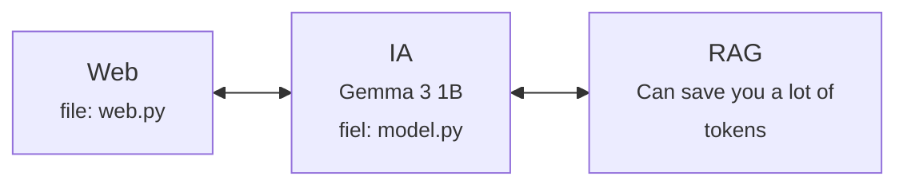

# KnowledgeBaseUPV
This project is my idea to improve the way the student use AI to prepare to their exams, with LLMs we can access, like ChatGPT, Claude, Gemini, ... , we need to spend time attaching all the PDFs, this action can take you a lot of time, and it's not enough to attach all the PDFs, because we can reach several PDFs.

## Pre-Requirements
**Python:** 3.11.9(*recommended*)
**Requirements.txt**: Look at it

## Architecture

## Step-by-Step
**Step 1:** *source .venv/bin/activate* at your root directory
