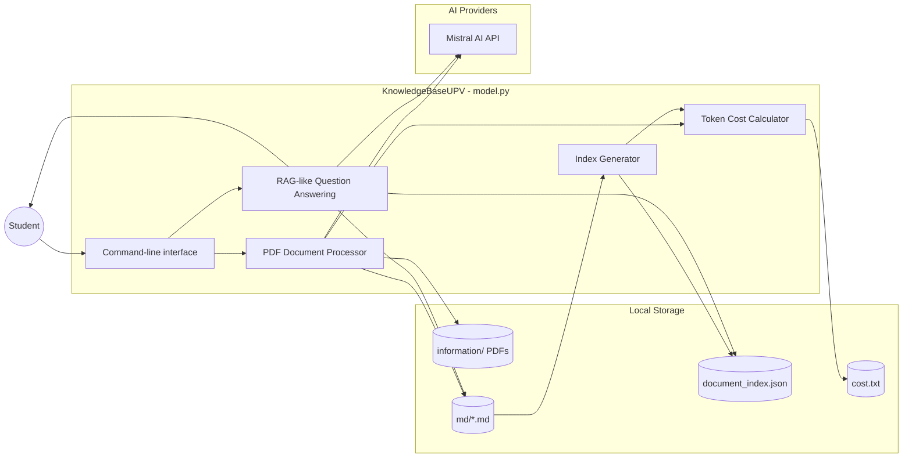

# KnowledgeBaseUPV Architecture

```mermaid
flowchart LR
    User((Student))

    subgraph Application["KnowledgeBaseUPV - model.py"]
        CLI[Command-line interface]
        Processor[PDF Document Processor]
        Indexer[Index Generator]
        RAG[RAG-like Question Answering]
        Cost[Token Cost Calculator]
    end

    subgraph Storage["Local Storage"]
        PDFs[(information/ PDFs)]
        Notes[(md/*.md)]
        Index[(document_index.json)]
        Costs[(cost.txt)]
    end

    subgraph AI["AI Providers"]
        Mistral[Mistral AI API]
    end

    User --> CLI
    CLI --> RAG
    CLI --> Processor

    Processor --> PDFs
    Processor --> Mistral
    Processor --> Notes

    Notes --> Indexer
    Indexer --> Index

    RAG --> Index
    RAG --> Notes
    RAG --> Mistral
    RAG --> User

    Processor --> Cost
    Indexer --> Cost
    Cost --> Costs

```